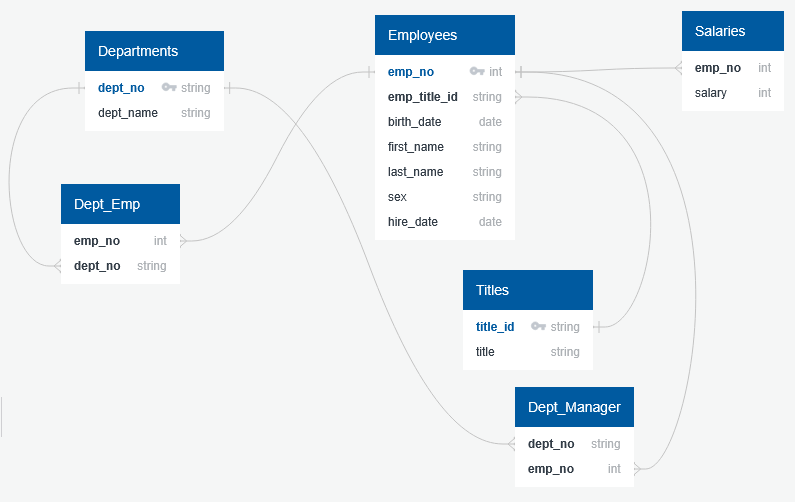

# Module 9: sql-challenge

## The Task
I've been hired as a new data engineer. My first major task is to do a research project about people whom the company employed during the 1980s and 1990s. All that remains of the employee database from that period are six CSV files.

For this project, I performed data modeling, data engineering, and data analysis.

## User Story
```md
AS A new data engineer
I WANT to design tables to hold employee data and import the data into a SQL database
SO THAT I can query the data and answer necessary questions.
```

## Acceptance Criteria
```md
Data Modeling
  * Entity Relationship Diagram is included or table schemas provided for all tables

Data Engineering
  * All required columns are defined for each table
  * Columns are set to the correct data type
  * Primary Keys set for each table
  * Correctly references related tables
  * Tables are correctly related using Foreign Keys
  * Correctly uses NOT NULL condition on necessary columns
  * Accurately defines value length for columns
  
Data Analysis
  * List the employee number, last name, first name, sex, and salary of each employee
  * List the first name, last name, and hire date for the employees who were hired in 1986
  * List the manager of each department along with their department number, department name, employee number, last name, and first name
  * List the department number for each employee along with that employee’s employee number, last name, first name, and department name
  * List first name, last name, and sex of each employee whose first name is Hercules and whose last name begins with the letter B
  * List each employee in the Sales department, including their employee number, last name, and first name
  * List each employee in the Sales and Development departments, including their employee number, last name, first name, and department name
  * List the frequency counts, in descending order, of all the employee last names (that is, how many employees share each last name)
```

## Entity Relationship Diagram


## License
This project is licensed under the GNU General Public License v3.0.  
License Link:
https://www.gnu.org/licenses/gpl-3.0.en.html   
[](https://www.gnu.org/licenses/gpl-3.0)
